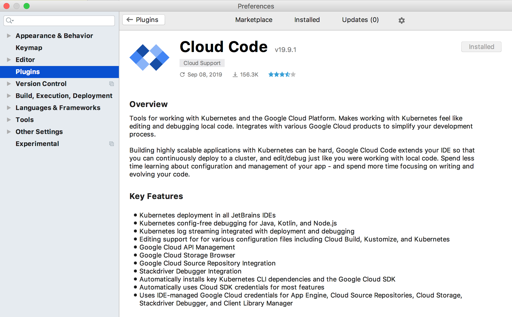

# Set up an IDE

- [IntelliJ IDEA](#intellij-idea)

## IntelliJ IDEA

> - Replace all references of `IntelliJ IDEA → Preferences` to `File → Settings` if you are using Windows or Linux.

Supported IntelliJ versions: IntelliJ IDEA Ultimate Edition (required to work with Google App Engine).
You can sign up for the free [JetBrains student license](https://www.jetbrains.com/student/) if you are a student registered in an educational institution.

### Prerequisites

1. You need a Java 8 SDK defined in IntelliJ IDEA as follows:

   * Click `Configure → Project Defaults → Project Structure` (or `File → Project Structure` if a project is open).
     Select `SDKs` under` Platform Settings` and check if there is an SDK with JDK home path pointing to a JDK 8 path.
     If there is none, add a new SDK which uses JDK 8.
     

1. You need the [Google Cloud Code](https://cloud.google.com/code/docs/intellij/quickstart-IDEA) plugin installed and configured:

   
   * During installation, you may encounter a prompt to disable the obsolete `Google App Engine Integration` plugin. Answer `Yes`.
   * After installation, restart IntelliJ IDEA.
   * (Optional) To configure the plugin to use a specific Cloud SDK installation,
     click `Configure → Settings/Preferences` (or `IntelliJ IDEA → Preferences` if a project is open),
     go to `Other Settings → Cloud Code → Cloud SDK`, choose `Use a custom local installation`, and select your Google Cloud SDK directory.

### Project Setup

1. Import the project as a Gradle project as follows:
   1. Click `Import Project` (or `File → New → Project from Existing Sources...` if a project is open).
   1. Select the local repository folder and click `Open`.
   1. Select `Import project from external model` and then `Gradle`.
   1. Click `Next`.
   1. Check `Use auto-import` and uncheck `Create separate module per source set`.
   1. Ensure `Create directories for empty content root automatically` is unchecked.
   1. Ensure `Use default gradle wrapper` is selected.
   1. Ensure for `Gradle JVM:` that a JDK 8 is selected.
   1. Click `Finish`. Wait for the indexing process to complete.
   1. You should see a dialog box with the message:\
      `Frameworks detected: Google App Engine Standard, Angular CLI frameworks are detected.`.\
      **OR**\
      `Frameworks detected: Web, Google App Engine Standard, Angular CLI frameworks are detected`.\
      Click on `Configure` and ensure that only `Google App Engine Standard` and `Angular CLI` frameworks are shown, then click `OK`.
      If there are other frameworks shown, click `Cancel` and wait until indexing is completed, then try again.
      > If you closed or missed the dialog box, go to `View → Tool Windows → Event Log`.
        You should see the same message as the message in the dialog box. Click `Configure` and then `OK`.

1. Configure the following project-specific settings (all can be found in `IntelliJ IDEA → Preferences → ...`):

   * Indentation: 2 spaces are used in place of tabs for indentations. For Java and XML, 4 spaces are used instead.
     Configure for all the languages used in TEAMMATES:
     1. Go to `Editor → Code Style`.
     1. Select `Project` for `Scheme` if you do not wish to make the settings the default for your IDE.
     1. For `TypeScript`, `JSON`, `CSS`, and `HTML`:
        * Ensure that `Use tab character` is unchecked, and `Tab size:`, `Indent:`, and `Continuation indent:` are `2`, `2`, and `4` respectively.
     1. Repeat the previous step for `Java` and `XML` using the numbers `4`, `4`, and `8` respectively.

   * Text encoding: `UTF-8` is used for text encoding.
     Go to `Editor → File Encodings` and ensure that `Project Encoding` and `Default Encoding for properties files` is set to `UTF-8`.

1. Click `OK`.

1. To move on to the development phase, refer to [this document](development.md).
